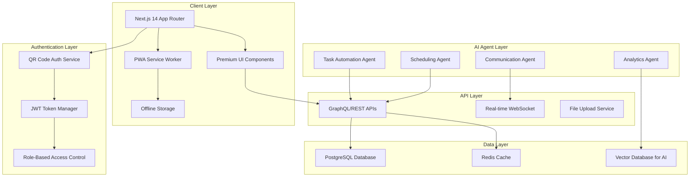

# Design Document

## Overview

The AI-Enhanced HomeschoolPlatform transforms the existing GuruKool HomeSchool application into a comprehensive, intelligent homeschooling management system. The design leverages modern web technologies, AI agents, premium UI components, and advanced authentication mechanisms to create a seamless experience for parents, teachers, and students.

The architecture follows a modular, extensible design pattern with clear separation of concerns, enabling scalability and maintainability while providing rich user experiences through high-end UI/UX components.

## Architecture

### System Architecture



### Technology Stack

**Frontend:**
- Next.js 14 with App Router for server-side rendering and routing
- TypeScript for type safety and developer experience
- Tailwind CSS with custom design system for styling
- Framer Motion for animations and micro-interactions
- Mantine UI or Chakra UI for premium component library
- React Hook Form with Zod for advanced form handling
- Recharts/D3.js for data visualization
- React Query (TanStack Query) for state management and caching

**Authentication & Security:**
- QR code generation with qrcode library
- WebSocket for real-time QR code authentication
- JWT tokens with refresh token rotation
- bcrypt for password hashing
- Rate limiting with express-rate-limit

**AI & Machine Learning:**
- OpenAI GPT-4 for natural language processing
- LangChain for AI agent orchestration
- Pinecone or Weaviate for vector database
- TensorFlow.js for client-side ML capabilities

**Backend Services:**
- Node.js with Express or Fastify
- GraphQL with Apollo Server
- PostgreSQL with Prisma ORM
- Redis for caching and session management
- WebSocket.io for real-time communication

## Components and Interfaces

### Core Components

#### 1. Authentication System

**QRAuthProvider Component:**
```typescript
interface QRAuthConfig {
  expirationTime: number; // 5 minutes
  refreshInterval: number; // 30 seconds
  fallbackEnabled: boolean;
}

interface QRAuthState {
  qrCode: string;
  isScanning: boolean;
  authStatus: 'pending' | 'success' | 'expired' | 'error';
  user?: User;
}
```

**Features:**
- Dynamic QR code generation with embedded session tokens
- Real-time authentication status updates via WebSocket
- Automatic QR code refresh before expiration
- Fallback to traditional login for accessibility
- Biometric authentication support for mobile devices

#### 2. AI Agent Framework

**AgentOrchestrator Component:**
```typescript
interface AIAgent {
  id: string;
  name: string;
  capabilities: string[];
  priority: number;
  execute(context: AgentContext): Promise<AgentResult>;
}

interface AgentContext {
  user: User;
  sessionData: SessionData;
  preferences: UserPreferences;
  historicalData: HistoricalData;
}
```

**Agent Types:**
- **TaskAutomationAgent**: Handles routine tasks like timesheet creation, notifications
- **AnalyticsAgent**: Processes learning data and generates insights
- **CommunicationAgent**: Manages intelligent notifications and messaging
- **SchedulingAgent**: Optimizes schedules and handles conflicts

#### 3. Premium UI Component Library

**Design System Components:**
```typescript
// Advanced Form Components
interface SmartFormProps {
  schema: ZodSchema;
  onSubmit: (data: any) => Promise<void>;
  aiAssisted?: boolean;
  realTimeValidation?: boolean;
}

// Data Visualization Components
interface AnalyticsDashboardProps {
  data: AnalyticsData;
  chartType: 'line' | 'bar' | 'pie' | 'heatmap';
  interactive?: boolean;
  aiInsights?: boolean;
}

// Interactive Elements
interface GestureCardProps {
  children: React.ReactNode;
  swipeActions?: SwipeAction[];
  dragEnabled?: boolean;
  hapticFeedback?: boolean;
}
```

#### 4. Offline-First Architecture

**SyncManager Component:**
```typescript
interface SyncConfig {
  syncInterval: number;
  conflictResolution: 'client' | 'server' | 'ai';
  priorityQueues: SyncPriority[];
}

interface OfflineAction {
  id: string;
  type: string;
  payload: any;
  timestamp: number;
  priority: 'high' | 'medium' | 'low';
}
```

### Interface Specifications

#### 1. User Interfaces

**Parent Dashboard Interface:**
- AI-powered priority feed with actionable insights
- Real-time teacher location and session status
- Interactive progress charts with drill-down capabilities
- Smart notification center with AI-filtered importance
- Gesture-based navigation with swipe actions

**Teacher Dashboard Interface:**
- Location-aware session management
- AI-suggested lesson plans and resources
- Voice-to-text session notes with AI enhancement
- Drag-and-drop schedule management
- Offline-capable timesheet tracking

**Student Interface (Future Enhancement):**
- Gamified learning progress tracking
- AI-powered study recommendations
- Interactive assignment submission
- Peer collaboration tools

#### 2. API Interfaces

**GraphQL Schema:**
```graphql
type User {
  id: ID!
  name: String!
  role: UserRole!
  preferences: UserPreferences
  sessions: [Session!]!
}

type Session {
  id: ID!
  student: Student!
  teacher: Teacher!
  subject: Subject!
  scheduledTime: DateTime!
  actualTime: TimeRange
  location: Location!
  status: SessionStatus!
  aiInsights: [Insight!]!
}

type AIInsight {
  id: ID!
  type: InsightType!
  content: String!
  confidence: Float!
  actionable: Boolean!
  createdAt: DateTime!
}
```

## Data Models

### Core Data Models

#### 1. User Management
```typescript
interface User {
  id: string;
  email: string;
  name: string;
  role: 'parent' | 'teacher' | 'admin';
  preferences: UserPreferences;
  createdAt: Date;
  lastActive: Date;
}

interface UserPreferences {
  notifications: NotificationSettings;
  dashboard: DashboardConfig;
  privacy: PrivacySettings;
  accessibility: AccessibilitySettings;
}
```

#### 2. Session Management
```typescript
interface Session {
  id: string;
  studentId: string;
  teacherId: string;
  parentId: string;
  subject: string;
  scheduledStart: Date;
  scheduledEnd: Date;
  actualStart?: Date;
  actualEnd?: Date;
  location: Location;
  status: SessionStatus;
  notes: string;
  aiInsights: AIInsight[];
  attachments: Attachment[];
}

interface Location {
  address: string;
  coordinates: {
    latitude: number;
    longitude: number;
  };
  verified: boolean;
}
```

#### 3. AI and Analytics
```typescript
interface AIInsight {
  id: string;
  sessionId: string;
  type: 'progress' | 'recommendation' | 'alert' | 'prediction';
  content: string;
  confidence: number;
  metadata: Record<string, any>;
  createdAt: Date;
}

interface LearningAnalytics {
  studentId: string;
  subject: string;
  progressMetrics: ProgressMetric[];
  learningPatterns: LearningPattern[];
  recommendations: Recommendation[];
  lastUpdated: Date;
}
```

### Database Schema Design

**PostgreSQL Tables:**
- `users` - User accounts and authentication
- `sessions` - Teaching sessions and scheduling
- `timesheets` - Automated time tracking
- `ai_insights` - AI-generated insights and recommendations
- `notifications` - Intelligent notification system
- `sync_queue` - Offline synchronization queue
- `audit_logs` - Security and compliance tracking

**Redis Cache Structure:**
- Session tokens and QR codes
- Real-time user presence
- AI model predictions cache
- Notification queues

## Error Handling

### Error Categories and Strategies

#### 1. Authentication Errors
```typescript
enum AuthErrorType {
  QR_EXPIRED = 'qr_expired',
  INVALID_TOKEN = 'invalid_token',
  INSUFFICIENT_PERMISSIONS = 'insufficient_permissions',
  RATE_LIMITED = 'rate_limited'
}

interface AuthErrorHandler {
  handleQRExpiration(): void;
  handleTokenRefresh(): Promise<boolean>;
  handlePermissionDenied(): void;
}
```

#### 2. AI Agent Errors
```typescript
enum AIErrorType {
  MODEL_UNAVAILABLE = 'model_unavailable',
  INSUFFICIENT_DATA = 'insufficient_data',
  PROCESSING_TIMEOUT = 'processing_timeout',
  CONFIDENCE_TOO_LOW = 'confidence_too_low'
}

interface AIErrorRecovery {
  fallbackToRuleBasedSystem(): void;
  queueForRetry(): void;
  notifyHumanIntervention(): void;
}
```

#### 3. Sync and Offline Errors
```typescript
interface SyncErrorHandler {
  handleConflictResolution(conflict: DataConflict): Promise<Resolution>;
  handleNetworkFailure(): void;
  handleStorageQuotaExceeded(): void;
}
```

### Error Recovery Mechanisms

1. **Graceful Degradation**: When AI services fail, fall back to rule-based systems
2. **Retry Logic**: Exponential backoff for transient failures
3. **User Feedback**: Clear, actionable error messages with recovery suggestions
4. **Logging and Monitoring**: Comprehensive error tracking for proactive resolution

## Testing Strategy

### Testing Pyramid

#### 1. Unit Tests (70%)
- Component testing with React Testing Library
- AI agent logic testing with mocked services
- Utility function testing
- Data model validation testing

#### 2. Integration Tests (20%)
- API endpoint testing
- Database integration testing
- Authentication flow testing
- Real-time communication testing

#### 3. End-to-End Tests (10%)
- Critical user journey testing with Playwright
- Cross-browser compatibility testing
- Mobile responsiveness testing
- Performance testing under load

### AI-Specific Testing

#### 1. AI Model Testing
```typescript
interface AITestSuite {
  testModelAccuracy(testData: TestDataset): Promise<AccuracyMetrics>;
  testBiasDetection(demographicData: DemographicData): Promise<BiasReport>;
  testResponseTime(inputSize: number): Promise<PerformanceMetrics>;
}
```

#### 2. Agent Behavior Testing
- Decision tree validation
- Context understanding verification
- Multi-agent coordination testing
- Fallback mechanism validation

### Testing Tools and Frameworks

- **Jest** for unit testing
- **React Testing Library** for component testing
- **Playwright** for E2E testing
- **MSW (Mock Service Worker)** for API mocking
- **Storybook** for component documentation and visual testing
- **Lighthouse CI** for performance testing

### Continuous Testing Pipeline

1. **Pre-commit hooks** with Husky for code quality
2. **Pull request testing** with automated test suites
3. **Staging environment testing** with real data simulation
4. **Production monitoring** with error tracking and performance metrics

This comprehensive design provides a solid foundation for building a premium, AI-enhanced homeschooling platform that meets all the specified requirements while maintaining high standards for user experience, security, and scalability.