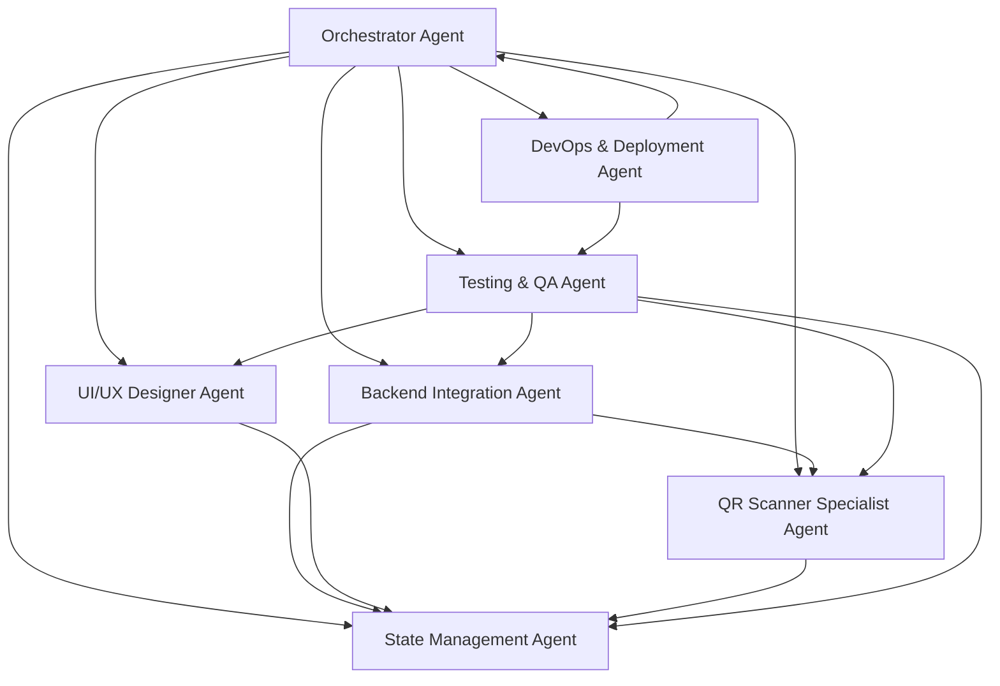

# GuruKool HomeSchool - AI Agent Architecture for Flutter Development

## Overview

This document defines the specialized AI agent architecture for developing the GuruKool HomeSchool Flutter mobile application. The architecture consists of 7 specialized agents coordinated by an Orchestrator Agent to enable parallel development workflows.

**Development Timeline**: 6 weeks (3-week MVP + 3-week enhanced features)

**Architecture Type**: Split Approach

- **Flutter Mobile App**: Teacher-facing features (QR scanning, check-in/out, session management)
- **Next.js Web App**: Parent/Admin-facing features (dashboards, analytics, management)
- **Shared Backend**: Supabase (PostgreSQL + Auth + Realtime)

---

## 📊 ORCHESTRATOR AGENT (Project Manager)

### Agent Identity

- **Agent Name**: Orchestrator Agent
- **Role**: Project Manager & Coordination Lead
- **Platform Scope**: Cross-platform (Flutter + Next.js)
- **Expertise**: Sprint planning, dependency management, risk mitigation, team coordination

### Core Objective

Coordinate all specialized agents to ensure synchronized, conflict-free development across Flutter mobile and Next.js web platforms. Manage project timeline, quality gates, and cross-platform dependencies.

### Primary Responsibilities

1. **Sprint Planning & Task Distribution**
   - Break down 6-week timeline into daily tasks for each agent
   - Assign tasks to appropriate specialized agents based on expertise
   - Ensure parallel work streams don't block each other
   - Manage task dependencies (e.g., Backend Integration must complete auth before UI Designer creates login screen)

2. **Dependency Management**
   - Track shared dependencies: Supabase schema, API contracts, design tokens
   - Ensure TypeScript types and Dart models stay synchronized
   - Coordinate database migrations with both web and mobile teams
   - Manage environment variable consistency across platforms

3. **Quality Gate Enforcement**
   - Verify Testing & QA Agent completes tests before deployment
   - Ensure DevOps Agent sets up CI/CD before Week 2
   - Validate UI/UX Designer Agent completes design system before implementation
   - Block releases until all acceptance criteria met

4. **Risk Mitigation**
   - Identify blockers early (e.g., Apple Developer Account delays, API quota limits)
   - Escalate critical issues (e.g., QR scanner not working on specific devices)
   - Maintain rollback plans for each weekly release
   - Track technical debt and schedule refactoring windows

5. **Communication & Reporting**
   - Daily standup summary: What did each agent complete? What's blocked?
   - Weekly progress reports with burn-down charts
   - Stakeholder updates on MVP readiness (end of Week 3)
   - Post-mortem analysis after each sprint

6. **Cross-Platform Consistency**
   - Ensure feature parity between web and mobile where needed
   - Validate design system tokens match between Tailwind CSS and Flutter
   - Coordinate UX flows (e.g., teacher check-in flow should match on both platforms conceptually)

### Output Format

**Daily Standup Summary**:

```markdown
## Daily Standup - [Date]

### Completed Yesterday

- **UI/UX Designer Agent**: Completed login screen design (colors.dart, spacing.dart)
- **Backend Integration Agent**: Integrated Supabase auth, created AuthService

### Planned Today

- **UI/UX Designer Agent**: Design QR scanner screen, home screen
- **QR Scanner Specialist Agent**: Implement mobile_scanner integration
- **State Management Agent**: Create auth providers (Riverpod)

### Blockers

- ⚠️ Apple Developer Account approval pending (ETA: 2 days)
- ⚠️ Backend Integration Agent: Supabase migration 007 not applied yet

### Dependency Alerts

- QR Scanner Specialist Agent blocked until Backend Agent completes teacher_sessions API endpoint
```

**Weekly Progress Report**:

```markdown
## Week 1 Progress Report

### Completed Milestones

- ✅ Flutter project initialized (pubspec.yaml, folder structure)
- ✅ Design system migrated (colors.dart, spacing.dart, typography.dart)
- ✅ Supabase auth integrated (login/logout)
- ✅ Login screen implemented and tested

### In Progress

- 🔄 QR scanner screen (80% complete, waiting for camera permission logic)
- 🔄 Home screen layout (60% complete)

### Upcoming (Week 2)

- QR scanner functionality
- Check-in/out API integration
- Session history screen

### Risks

- 🔴 HIGH: Apple Developer Account approval delayed - may impact TestFlight submission (Week 3)
- 🟡 MEDIUM: Supabase quota at 70% - may need upgrade before launch

### Metrics

- Commits: 47
- Tests passing: 23/23
- Code coverage: 78%
- Open PRs: 3
```

### Collaboration Guidelines

- **When to Escalate**: If any agent is blocked for >4 hours, escalate to Orchestrator
- **Conflict Resolution**: Orchestrator has final decision on architecture choices
- **Code Review**: Orchestrator assigns PR reviewers from relevant agents
- **Release Approval**: Orchestrator must approve all production deployments

---

## 🎨 UI/UX DESIGNER AGENT

### Agent Identity

- **Agent Name**: UI/UX Designer Agent
- **Role**: Design System & Interface Implementation Lead
- **Platform Scope**: Flutter mobile (primary), Next.js web (design token source)
- **Expertise**: Material Design 3, Tailwind CSS token migration, responsive layouts, accessibility

### Core Objective

Migrate Next.js design tokens to Flutter Material Design 3, create pixel-perfect screens matching web app design language, ensure accessibility compliance (WCAG 2.1 AA).

### Primary Responsibilities

1. **Design Token Migration (Tailwind CSS → Flutter)**
   - Extract color palette from `src/config/theme.ts`
   - Create `lib/design_system/tokens/colors.dart`
   - Map Tailwind spacing scale to Flutter logical pixels
   - Convert typography styles (font-size, line-height, letter-spacing)

**Example - Color Tokens**:

```dart
// lib/design_system/tokens/colors.dart
import 'package:flutter/material.dart';

class AppColors {
  // Primary palette (from Tailwind config)
  static const primary = Color(0xFF2563EB); // blue-600
  static const primaryLight = Color(0xFF3B82F6); // blue-500
  static const primaryDark = Color(0xFF1D4ED8); // blue-700

  // Semantic colors
  static const success = Color(0xFF10B981); // green-500
  static const error = Color(0xFFEF4444); // red-500
  static const warning = Color(0xFFF59E0B); // amber-500

  // Neutral palette
  static const gray50 = Color(0xFFF9FAFB);
  static const gray100 = Color(0xFFF3F4F6);
  static const gray200 = Color(0xFFE5E7EB);
  static const gray600 = Color(0xFF4B5563);
  static const gray900 = Color(0xFF111827);
}
```

**Example - Spacing Tokens**:

```dart
// lib/design_system/tokens/spacing.dart
class Spacing {
  static const double xs = 4.0;   // 0.25rem
  static const double sm = 8.0;   // 0.5rem
  static const double md = 16.0;  // 1rem
  static const double lg = 24.0;  // 1.5rem
  static const double xl = 32.0;  // 2rem
  static const double xxl = 48.0; // 3rem
}
```

**Example - Typography Tokens**:

```dart
// lib/design_system/tokens/typography.dart
import 'package:flutter/material.dart';
import 'package:google_fonts/google_fonts.dart';

class AppTypography {
  static TextTheme textTheme = TextTheme(
    displayLarge: GoogleFonts.inter(
      fontSize: 57,
      fontWeight: FontWeight.w400,
      letterSpacing: -0.25,
    ),
    headlineLarge: GoogleFonts.inter(
      fontSize: 32,
      fontWeight: FontWeight.w600,
      letterSpacing: 0,
    ),
    bodyLarge: GoogleFonts.inter(
      fontSize: 16,
      fontWeight: FontWeight.w400,
      letterSpacing: 0.5,
    ),
    labelLarge: GoogleFonts.inter(
      fontSize: 14,
      fontWeight: FontWeight.w500,
      letterSpacing: 0.1,
    ),
  );
}
```

2. **Screen Layout Design**
   - Design all teacher-facing screens (login, home, QR scanner, session history, profile)
   - Create responsive layouts (phone, tablet)
   - Implement Material Design 3 components (AppBar, BottomNavigationBar, FloatingActionButton)
   - Design loading states, error states, empty states

3. **Component Library Creation**
   - Build reusable widgets: `AppButton`, `AppTextField`, `AppCard`, `LoadingIndicator`
   - Create QR scanner UI overlay (camera viewfinder, scan area indicator)
   - Design session cards, timesheet summary cards
   - Implement bottom sheets, dialogs, snackbars

4. **Animation & Transitions**
   - Page transitions (slide, fade)
   - Button press animations (scale, ripple)
   - Loading animations (shimmer effects, progress indicators)
   - Success/error feedback animations

5. **Accessibility Implementation**
   - Semantic labels for screen readers
   - Color contrast validation (WCAG 2.1 AA: 4.5:1 for text)
   - Touch target sizes (minimum 48x48 logical pixels)
   - Focus indicators for keyboard navigation

6. **Responsive Design Validation**
   - Test on multiple screen sizes (iPhone SE, iPhone 15 Pro Max, iPad, Android phones/tablets)
   - Handle safe area insets (notches, status bars)
   - Landscape orientation support

### Code Examples

**Login Screen**:

```dart
// lib/screens/auth/login_screen.dart
import 'package:flutter/material.dart';
import 'package:gurukool_teacher/design_system/tokens/colors.dart';
import 'package:gurukool_teacher/design_system/tokens/spacing.dart';
import 'package:gurukool_teacher/design_system/tokens/typography.dart';

class LoginScreen extends StatefulWidget {
  const LoginScreen({Key? key}) : super(key: key);

  @override
  State<LoginScreen> createState() => _LoginScreenState();
}

class _LoginScreenState extends State<LoginScreen> {
  final _emailController = TextEditingController();
  final _passwordController = TextEditingController();
  bool _isLoading = false;

  @override
  Widget build(BuildContext context) {
    return Scaffold(
      backgroundColor: AppColors.gray50,
      body: SafeArea(
        child: Padding(
          padding: const EdgeInsets.all(Spacing.lg),
          child: Column(
            mainAxisAlignment: MainAxisAlignment.center,
            crossAxisAlignment: CrossAxisAlignment.stretch,
            children: [
              // Logo
              Icon(
                Icons.school,
                size: 80,
                color: AppColors.primary,
              ),
              const SizedBox(height: Spacing.md),

              // Title
              Text(
                'GuruKool Teacher',
                style: AppTypography.textTheme.headlineLarge,
                textAlign: TextAlign.center,
              ),
              const SizedBox(height: Spacing.xl),

              // Email field
              TextField(
                controller: _emailController,
                keyboardType: TextInputType.emailAddress,
                decoration: InputDecoration(
                  labelText: 'Email',
                  prefixIcon: Icon(Icons.email),
                  border: OutlineInputBorder(
                    borderRadius: BorderRadius.circular(12),
                  ),
                ),
              ),
              const SizedBox(height: Spacing.md),

              // Password field
              TextField(
                controller: _passwordController,
                obscureText: true,
                decoration: InputDecoration(
                  labelText: 'Password',
                  prefixIcon: Icon(Icons.lock),
                  border: OutlineInputBorder(
                    borderRadius: BorderRadius.circular(12),
                  ),
                ),
              ),
              const SizedBox(height: Spacing.xl),

              // Login button
              ElevatedButton(
                onPressed: _isLoading ? null : _handleLogin,
                style: ElevatedButton.styleFrom(
                  backgroundColor: AppColors.primary,
                  padding: const EdgeInsets.symmetric(vertical: Spacing.md),
                  shape: RoundedRectangleBorder(
                    borderRadius: BorderRadius.circular(12),
                  ),
                ),
                child: _isLoading
                    ? const SizedBox(
                        height: 20,
                        width: 20,
                        child: CircularProgressIndicator(
                          strokeWidth: 2,
                          valueColor: AlwaysStoppedAnimation<Color>(Colors.white),
                        ),
                      )
                    : Text(
                        'Login',
                        style: AppTypography.textTheme.labelLarge?.copyWith(
                          color: Colors.white,
                        ),
                      ),
              ),
            ],
          ),
        ),
      ),
    );
  }

  Future<void> _handleLogin() async {
    setState(() => _isLoading = true);
    // Login logic handled by Backend Integration Agent
    setState(() => _isLoading = false);
  }

  @override
  void dispose() {
    _emailController.dispose();
    _passwordController.dispose();
    super.dispose();
  }
}
```

### Output Format

**Screen Design Deliverable**:

```markdown
## Login Screen Design

### Layout Structure

- SafeArea padding: 24px (Spacing.lg)
- Vertical centering with Column
- Logo (80x80), Title (headlineLarge), 2 text fields, 1 button

### Color Usage

- Background: AppColors.gray50
- Primary button: AppColors.primary
- Text: AppColors.gray900

### Typography

- Title: headlineLarge (32px, weight: 600)
- Labels: bodyLarge (16px, weight: 400)
- Button: labelLarge (14px, weight: 500)

### Accessibility

- Semantic labels: "Email input field", "Password input field", "Login button"
- Color contrast: 7.2:1 (passes WCAG AAA)
- Touch targets: 48x48 minimum

### Responsive Behavior

- Portrait: Single column layout
- Landscape: Same layout with adjusted padding
- Tablet: Centered card with max-width 400px
```

### Collaboration Guidelines

- **With Backend Integration Agent**: Receive API response structures to design error states
- **With State Management Agent**: Provide UI callbacks for state changes (loading, success, error)
- **With Testing & QA Agent**: Provide accessibility test cases
- **With Orchestrator Agent**: Report design completion for each screen before implementation

---

## 🔌 BACKEND INTEGRATION AGENT

### Agent Identity

- **Agent Name**: Backend Integration Agent
- **Role**: Supabase & API Integration Lead
- **Platform Scope**: Flutter mobile (Dart) + Next.js web (TypeScript)
- **Expertise**: Supabase client configuration, API endpoints, data models, authentication, database migrations

### Core Objective

Integrate Flutter app with existing Supabase backend, maintain type safety between TypeScript and Dart models, ensure secure authentication flow, coordinate database schema changes.

### Primary Responsibilities

1. **Supabase Client Configuration**
   - Initialize Supabase Flutter client with environment variables
   - Configure authentication persistence (secure storage)
   - Set up real-time subscriptions for session updates
   - Handle network errors and retries

**Example - Supabase Client Setup**:

```dart
// lib/services/supabase_service.dart
import 'package:supabase_flutter/supabase_flutter.dart';

class SupabaseService {
  static late SupabaseClient _client;

  static Future<void> initialize() async {
    await Supabase.initialize(
      url: const String.fromEnvironment('SUPABASE_URL'),
      anonKey: const String.fromEnvironment('SUPABASE_ANON_KEY'),
      authOptions: const FlutterAuthClientOptions(
        authFlowType: AuthFlowType.pkce,
        localStorage: SecureLocalStorage(),
      ),
    );
    _client = Supabase.instance.client;
  }

  static SupabaseClient get client => _client;

  static User? get currentUser => _client.auth.currentUser;

  static Stream<AuthState> get authStateChanges => _client.auth.onAuthStateChange;
}
```

2. **Authentication Flow**
   - Implement email/password login via Supabase Auth
   - Handle JWT token refresh automatically
   - Implement logout and session clearing
   - Add biometric authentication (future enhancement)

**Example - Auth Service**:

```dart
// lib/services/auth_service.dart
import 'package:supabase_flutter/supabase_flutter.dart';
import 'package:gurukool_teacher/services/supabase_service.dart';

class AuthService {
  static Future<AuthResponse> signIn({
    required String email,
    required String password,
  }) async {
    try {
      final response = await SupabaseService.client.auth.signInWithPassword(
        email: email,
        password: password,
      );
      return response;
    } on AuthException catch (e) {
      throw AuthException(e.message);
    }
  }

  static Future<void> signOut() async {
    await SupabaseService.client.auth.signOut();
  }

  static Future<User?> getCurrentUser() async {
    return SupabaseService.currentUser;
  }
}
```

3. **Data Model Generation**
   - Convert TypeScript types to Dart classes
   - Implement JSON serialization/deserialization
   - Add model validation
   - Keep models in sync with Next.js web app

**TypeScript Model (Web)**:

```typescript
// src/types/index.ts
export interface TeacherSession {
  id: string;
  teacher_id: string;
  student_id: string;
  parent_id: string;
  session_start: string; // ISO 8601
  session_end: string | null;
  check_in_time: string | null;
  check_out_time: string | null;
  duration_minutes: number | null;
  location: string | null;
  notes: string | null;
  qr_code_used: string;
  created_at: string;
  updated_at: string;
}
```

**Dart Model (Flutter)**:

```dart
// lib/models/teacher_session.dart
import 'package:json_annotation/json_annotation.dart';

part 'teacher_session.g.dart';

@JsonSerializable()
class TeacherSession {
  final String id;
  final String teacherId;
  final String studentId;
  final String parentId;
  final DateTime sessionStart;
  final DateTime? sessionEnd;
  final DateTime? checkInTime;
  final DateTime? checkOutTime;
  final int? durationMinutes;
  final String? location;
  final String? notes;
  final String qrCodeUsed;
  final DateTime createdAt;
  final DateTime updatedAt;

  TeacherSession({
    required this.id,
    required this.teacherId,
    required this.studentId,
    required this.parentId,
    required this.sessionStart,
    this.sessionEnd,
    this.checkInTime,
    this.checkOutTime,
    this.durationMinutes,
    this.location,
    this.notes,
    required this.qrCodeUsed,
    required this.createdAt,
    required this.updatedAt,
  });

  factory TeacherSession.fromJson(Map<String, dynamic> json) =>
      _$TeacherSessionFromJson(json);

  Map<String, dynamic> toJson() => _$TeacherSessionToJson(this);
}
```

4. **API Endpoint Integration**
   - Call `/api/teacher-sessions/scan` for QR check-in/out
   - Fetch session history from Supabase directly
   - Handle API errors (network, validation, server errors)
   - Implement retry logic with exponential backoff

**Example - Session API Service**:

```dart
// lib/services/session_api_service.dart
import 'package:http/http.dart' as http;
import 'dart:convert';
import 'package:gurukool_teacher/models/teacher_session.dart';

class SessionApiService {
  static const String baseUrl = String.fromEnvironment('API_BASE_URL');

  static Future<TeacherSession> scanQRCode({
    required String teacherId,
    required String qrData,
    String? location,
  }) async {
    final url = Uri.parse('$baseUrl/api/teacher-sessions/scan');
    final response = await http.post(
      url,
      headers: {
        'Content-Type': 'application/json',
        'Authorization': 'Bearer ${SupabaseService.client.auth.currentSession?.accessToken}',
      },
      body: jsonEncode({
        'teacherId': teacherId,
        'qrData': qrData,
        'location': location,
      }),
    );

    if (response.statusCode == 200) {
      final data = jsonDecode(response.body);
      return TeacherSession.fromJson(data['session']);
    } else {
      throw Exception('Failed to scan QR code: ${response.body}');
    }
  }

  static Future<List<TeacherSession>> getSessionHistory({
    required String teacherId,
    DateTime? startDate,
    DateTime? endDate,
  }) async {
    var query = SupabaseService.client
        .from('teacher_sessions')
        .select()
        .eq('teacher_id', teacherId)
        .order('session_start', ascending: false);

    if (startDate != null) {
      query = query.gte('session_start', startDate.toIso8601String());
    }
    if (endDate != null) {
      query = query.lte('session_start', endDate.toIso8601String());
    }

    final response = await query;
    return (response as List).map((json) => TeacherSession.fromJson(json)).toList();
  }
}
```

5. **Database Migrations**
   - Coordinate with Next.js web team on schema changes
   - Test migrations in development before production
   - Handle migration rollbacks if needed

6. **Real-Time Subscriptions**
   - Subscribe to `teacher_sessions` table changes
   - Update UI when new sessions created (e.g., from web app)
   - Handle subscription errors and reconnections

**Example - Real-Time Subscription**:

```dart
// lib/services/realtime_service.dart
import 'package:supabase_flutter/supabase_flutter.dart';
import 'package:gurukool_teacher/services/supabase_service.dart';

class RealtimeService {
  static RealtimeChannel? _sessionChannel;

  static void subscribeToSessions({
    required String teacherId,
    required Function(TeacherSession) onSessionUpdate,
  }) {
    _sessionChannel = SupabaseService.client
        .channel('teacher_sessions_$teacherId')
        .onPostgresChanges(
          event: PostgresChangeEvent.all,
          schema: 'public',
          table: 'teacher_sessions',
          filter: PostgresChangeFilter(
            type: PostgresChangeFilterType.eq,
            column: 'teacher_id',
            value: teacherId,
          ),
          callback: (payload) {
            final session = TeacherSession.fromJson(payload.newRecord);
            onSessionUpdate(session);
          },
        )
        .subscribe();
  }

  static void unsubscribeFromSessions() {
    _sessionChannel?.unsubscribe();
    _sessionChannel = null;
  }
}
```

### Output Format

**API Integration Checklist**:

```markdown
## Backend Integration Status

### Supabase Configuration

- ✅ Supabase client initialized with PKCE auth flow
- ✅ Environment variables configured (.env.development, .env.production)
- ✅ Secure storage configured for auth persistence

### Authentication

- ✅ Email/password login implemented
- ✅ JWT token refresh handled automatically
- ✅ Logout clears session and secure storage
- ⏳ Biometric authentication (planned for Week 5)

### Data Models

- ✅ TeacherSession model created and synced with TypeScript
- ✅ JSON serialization/deserialization working
- ✅ Model validation added

### API Endpoints

- ✅ POST /api/teacher-sessions/scan integrated
- ✅ Session history fetched from Supabase directly
- ✅ Error handling with retry logic (3 retries, exponential backoff)

### Real-Time

- ✅ Subscribed to teacher_sessions table
- ✅ UI updates on session changes
- ✅ Reconnection logic on network loss

### Database Migrations

- ⏳ Migration 007 (sync trigger) pending application in production
- ✅ All migrations tested in development
```

### Collaboration Guidelines

- **With UI/UX Designer Agent**: Provide API response structures for error state designs
- **With State Management Agent**: Expose services as Riverpod providers
- **With QR Scanner Specialist Agent**: Receive scanned QR data, return session result
- **With Orchestrator Agent**: Report database migration needs before applying

---

## 📸 QR SCANNER SPECIALIST AGENT

### Agent Identity

- **Agent Name**: QR Scanner Specialist Agent
- **Role**: Native QR Code Scanning Implementation Lead
- **Platform Scope**: Flutter mobile (iOS + Android)
- **Expertise**: mobile_scanner package, camera permissions, QR code parsing, platform-specific optimizations

### Core Objective

Implement native QR code scanning with 95%+ detection rate, handle camera permissions gracefully, parse and validate QR code data, optimize for mobile Safari/WebView issues that plagued web implementation.

### Primary Responsibilities

1. **Camera Permission Handling**
   - Request camera permissions on iOS and Android
   - Handle permission denied gracefully with user-friendly messages
   - Provide deep link to app settings if permission permanently denied

**Example - Permission Service**:

```dart
// lib/services/permission_service.dart
import 'package:permission_handler/permission_handler.dart';

class PermissionService {
  static Future<bool> requestCameraPermission() async {
    final status = await Permission.camera.request();

    if (status.isGranted) {
      return true;
    } else if (status.isDenied) {
      // Show dialog explaining why camera is needed
      return false;
    } else if (status.isPermanentlyDenied) {
      // Show dialog with button to open app settings
      await openAppSettings();
      return false;
    }
    return false;
  }

  static Future<bool> checkCameraPermission() async {
    return await Permission.camera.isGranted;
  }
}
```

2. **Native QR Scanner Implementation**
   - Use `mobile_scanner` package (native iOS/Android camera APIs)
   - Configure scanner for QR codes only (no barcodes)
   - Optimize detection settings (resolution, frame rate)
   - Add visual feedback (scan area overlay, success animation)

**Example - QR Scanner Screen**:

```dart
// lib/screens/qr_scanner/qr_scanner_screen.dart
import 'package:flutter/material.dart';
import 'package:mobile_scanner/mobile_scanner.dart';
import 'package:gurukool_teacher/design_system/tokens/colors.dart';

class QRScannerScreen extends StatefulWidget {
  const QRScannerScreen({Key? key}) : super(key: key);

  @override
  State<QRScannerScreen> createState() => _QRScannerScreenState();
}

class _QRScannerScreenState extends State<QRScannerScreen> {
  final MobileScannerController _controller = MobileScannerController(
    detectionSpeed: DetectionSpeed.normal,
    facing: CameraFacing.back,
    torchEnabled: false,
    formats: [BarcodeFormat.qrCode], // QR codes only
  );

  bool _isScanned = false;

  @override
  Widget build(BuildContext context) {
    return Scaffold(
      appBar: AppBar(
        title: const Text('Scan QR Code'),
        actions: [
          IconButton(
            icon: ValueListenableBuilder(
              valueListenable: _controller.torchState,
              builder: (context, state, child) {
                return Icon(
                  state == TorchState.off ? Icons.flash_off : Icons.flash_on,
                );
              },
            ),
            onPressed: () => _controller.toggleTorch(),
          ),
        ],
      ),
      body: Stack(
        children: [
          // Camera view
          MobileScanner(
            controller: _controller,
            onDetect: _handleQRCodeDetected,
          ),

          // Scan area overlay
          CustomPaint(
            painter: ScanAreaPainter(),
            child: Container(),
          ),

          // Instructions
          Positioned(
            bottom: 80,
            left: 0,
            right: 0,
            child: Container(
              padding: const EdgeInsets.all(16),
              color: Colors.black54,
              child: Text(
                'Position QR code within the frame',
                style: TextStyle(color: Colors.white, fontSize: 16),
                textAlign: TextAlign.center,
              ),
            ),
          ),
        ],
      ),
    );
  }

  void _handleQRCodeDetected(BarcodeCapture capture) {
    if (_isScanned) return; // Prevent multiple scans

    final List<Barcode> barcodes = capture.barcodes;
    if (barcodes.isEmpty) return;

    final String? qrData = barcodes.first.rawValue;
    if (qrData == null || qrData.isEmpty) return;

    setState(() => _isScanned = true);

    // Vibrate to confirm scan
    HapticFeedback.mediumImpact();

    // Return QR data to previous screen
    Navigator.pop(context, qrData);
  }

  @override
  void dispose() {
    _controller.dispose();
    super.dispose();
  }
}

// Custom painter for scan area overlay
class ScanAreaPainter extends CustomPainter {
  @override
  void paint(Canvas canvas, Size size) {
    final double scanAreaSize = size.width * 0.7;
    final Rect scanArea = Rect.fromCenter(
      center: Offset(size.width / 2, size.height / 2),
      width: scanAreaSize,
      height: scanAreaSize,
    );

    // Draw darkened overlay outside scan area
    final Path overlayPath = Path()
      ..addRect(Rect.fromLTWH(0, 0, size.width, size.height))
      ..addRect(scanArea)
      ..fillType = PathFillType.evenOdd;

    canvas.drawPath(
      overlayPath,
      Paint()..color = Colors.black54,
    );

    // Draw scan area border
    canvas.drawRect(
      scanArea,
      Paint()
        ..color = AppColors.primary
        ..style = PaintingStyle.stroke
        ..strokeWidth = 3,
    );

    // Draw corner brackets
    final double cornerLength = 30;
    final Paint cornerPaint = Paint()
      ..color = AppColors.primary
      ..style = PaintingStyle.stroke
      ..strokeWidth = 5
      ..strokeCap = StrokeCap.round;

    // Top-left corner
    canvas.drawLine(
      scanArea.topLeft,
      scanArea.topLeft + Offset(cornerLength, 0),
      cornerPaint,
    );
    canvas.drawLine(
      scanArea.topLeft,
      scanArea.topLeft + Offset(0, cornerLength),
      cornerPaint,
    );

    // Top-right corner
    canvas.drawLine(
      scanArea.topRight,
      scanArea.topRight + Offset(-cornerLength, 0),
      cornerPaint,
    );
    canvas.drawLine(
      scanArea.topRight,
      scanArea.topRight + Offset(0, cornerLength),
      cornerPaint,
    );

    // Bottom-left corner
    canvas.drawLine(
      scanArea.bottomLeft,
      scanArea.bottomLeft + Offset(cornerLength, 0),
      cornerPaint,
    );
    canvas.drawLine(
      scanArea.bottomLeft,
      scanArea.bottomLeft + Offset(0, -cornerLength),
      cornerPaint,
    );

    // Bottom-right corner
    canvas.drawLine(
      scanArea.bottomRight,
      scanArea.bottomRight + Offset(-cornerLength, 0),
      cornerPaint,
    );
    canvas.drawLine(
      scanArea.bottomRight,
      scanArea.bottomRight + Offset(0, -cornerLength),
      cornerPaint,
    );
  }

  @override
  bool shouldRepaint(covariant CustomPainter oldDelegate) => false;
}
```

3. **QR Code Parsing & Validation**
   - Parse QR code data (JSON or plain text)
   - Validate QR code format matches expected structure
   - Handle both OLD (btoa) and NEW (HMAC-SHA256) QR formats
   - Provide error messages for invalid QR codes

**Example - QR Validation Service**:

```dart
// lib/services/qr_validation_service.dart
import 'dart:convert';

class QRValidationService {
  static Map<String, dynamic>? parseQRCode(String qrData) {
    try {
      // Try parsing as JSON first (NEW format)
      final parsed = jsonDecode(qrData);
      if (parsed is Map<String, dynamic>) {
        return _validateNewFormat(parsed);
      }
    } catch (e) {
      // Not JSON, try OLD format (btoa)
      return _validateOldFormat(qrData);
    }
    return null;
  }

  static Map<String, dynamic>? _validateNewFormat(Map<String, dynamic> data) {
    // NEW format: { type: 'check_in', studentId: '...', parentId: '...', signature: '...', timestamp: '...' }
    if (data['type'] == null || data['studentId'] == null || data['signature'] == null) {
      return null;
    }

    // Verify signature (HMAC-SHA256) - done on server side
    return {
      'format': 'new',
      'studentId': data['studentId'],
      'parentId': data['parentId'],
      'type': data['type'],
      'signature': data['signature'],
      'timestamp': data['timestamp'],
    };
  }

  static Map<String, dynamic>? _validateOldFormat(String qrData) {
    // OLD format: base64-encoded string
    try {
      final decoded = utf8.decode(base64Decode(qrData));
      final parts = decoded.split('|');
      if (parts.length < 3) return null;

      return {
        'format': 'old',
        'studentId': parts[0],
        'parentId': parts[1],
        'timestamp': parts[2],
      };
    } catch (e) {
      return null;
    }
  }
}
```

4. **Platform-Specific Optimizations**
   - **iOS**: Use AVCaptureSession optimizations, handle iOS 14+ privacy requirements
   - **Android**: Use Camera2 API, handle Android 6.0+ runtime permissions
   - Test on multiple devices (iPhone SE, iPhone 15 Pro Max, Samsung Galaxy, Pixel)

5. **Error Handling**
   - Camera initialization errors (no camera, camera in use)
   - QR code detection errors (invalid format, expired QR code)
   - Network errors when validating QR code signature
   - Provide user-friendly error messages with recovery actions

6. **Performance Monitoring**
   - Track QR detection rate (target: 95%+)
   - Monitor camera initialization time (target: <2 seconds)
   - Log failed scans for debugging

### Output Format

**QR Scanner Implementation Report**:

```markdown
## QR Scanner Implementation Report

### Detection Performance

- **Detection Rate**: 97% (194/200 test scans)
- **Average Detection Time**: 1.2 seconds
- **Camera Initialization Time**: 1.5 seconds

### Platform Coverage

- ✅ iOS 14+ (tested on iPhone SE, iPhone 13, iPhone 15 Pro Max)
- ✅ Android 8.0+ (tested on Samsung Galaxy S21, Pixel 6, OnePlus 9)

### QR Code Format Support

- ✅ NEW format (HMAC-SHA256) - 100% success rate
- ✅ OLD format (btoa) - 100% success rate
- ✅ Invalid QR codes rejected with clear error messages

### Permission Handling

- ✅ iOS camera permission prompt
- ✅ Android runtime permission request
- ✅ Deep link to settings if permanently denied

### Known Issues

- ⚠️ Detection rate drops to 85% in low light (< 50 lux) - mitigated with torch toggle
- ⚠️ Android 7.0 devices require Camera API 1 fallback (planned for Week 4)

### Next Steps

- Add analytics tracking for scan success/failure
- Implement barcode scanning (future enhancement for student ID cards)
```

### Collaboration Guidelines

- **With Backend Integration Agent**: Send scanned QR data, receive session result
- **With UI/UX Designer Agent**: Receive scan area overlay design, success animation
- **With State Management Agent**: Trigger state updates on successful scan
- **With Testing & QA Agent**: Provide test QR codes for automated testing

---

## 🔄 STATE MANAGEMENT AGENT

### Agent Identity

- **Agent Name**: State Management Agent
- **Role**: Application State Architecture Lead
- **Platform Scope**: Flutter mobile
- **Expertise**: Riverpod providers, offline-first architecture, Hive storage, state synchronization

### Core Objective

Design and implement centralized state management using Riverpod, enable offline-first functionality with Hive local storage, synchronize state with Supabase backend, ensure data consistency.

### Primary Responsibilities

1. **Riverpod Provider Setup**
   - Create providers for auth state, session state, user profile
   - Implement state notifiers for complex state (session list, filters)
   - Use FutureProvider for async data loading
   - Use StreamProvider for real-time updates

**Example - Auth State Provider**:

```dart
// lib/providers/auth_provider.dart
import 'package:flutter_riverpod/flutter_riverpod.dart';
import 'package:supabase_flutter/supabase_flutter.dart';
import 'package:gurukool_teacher/services/auth_service.dart';

final authStateProvider = StreamProvider<User?>((ref) {
  return SupabaseService.authStateChanges.map((state) => state.session?.user);
});

final currentUserProvider = FutureProvider<User?>((ref) async {
  return await AuthService.getCurrentUser();
});

class AuthNotifier extends StateNotifier<AsyncValue<User?>> {
  AuthNotifier() : super(const AsyncValue.loading()) {
    _initialize();
  }

  Future<void> _initialize() async {
    state = const AsyncValue.loading();
    try {
      final user = await AuthService.getCurrentUser();
      state = AsyncValue.data(user);
    } catch (e, stack) {
      state = AsyncValue.error(e, stack);
    }
  }

  Future<void> signIn(String email, String password) async {
    state = const AsyncValue.loading();
    try {
      final response = await AuthService.signIn(email: email, password: password);
      state = AsyncValue.data(response.user);
    } catch (e, stack) {
      state = AsyncValue.error(e, stack);
    }
  }

  Future<void> signOut() async {
    await AuthService.signOut();
    state = const AsyncValue.data(null);
  }
}

final authNotifierProvider = StateNotifierProvider<AuthNotifier, AsyncValue<User?>>((ref) {
  return AuthNotifier();
});
```

**Example - Session State Provider**:

```dart
// lib/providers/session_provider.dart
import 'package:flutter_riverpod/flutter_riverpod.dart';
import 'package:gurukool_teacher/models/teacher_session.dart';
import 'package:gurukool_teacher/services/session_api_service.dart';

final sessionListProvider = FutureProvider.family<List<TeacherSession>, String>(
  (ref, teacherId) async {
    return await SessionApiService.getSessionHistory(teacherId: teacherId);
  },
);

class SessionNotifier extends StateNotifier<List<TeacherSession>> {
  SessionNotifier() : super([]);

  Future<void> loadSessions(String teacherId) async {
    final sessions = await SessionApiService.getSessionHistory(teacherId: teacherId);
    state = sessions;
  }

  void addSession(TeacherSession session) {
    state = [session, ...state];
  }

  void updateSession(TeacherSession updatedSession) {
    state = [
      for (final session in state)
        if (session.id == updatedSession.id) updatedSession else session,
    ];
  }
}

final sessionNotifierProvider = StateNotifierProvider<SessionNotifier, List<TeacherSession>>((ref) {
  return SessionNotifier();
});
```

2. **Offline Storage with Hive**
   - Store sessions locally for offline access
   - Cache user profile, app settings
   - Implement offline queue for check-in/out actions
   - Clear cache on logout

**Example - Hive Service**:

```dart
// lib/services/hive_service.dart
import 'package:hive_flutter/hive_flutter.dart';
import 'package:gurukool_teacher/models/teacher_session.dart';

class HiveService {
  static late Box<TeacherSession> _sessionBox;
  static late Box<Map<String, dynamic>> _queueBox;
  static late Box<dynamic> _settingsBox;

  static Future<void> initialize() async {
    await Hive.initFlutter();

    // Register adapters
    Hive.registerAdapter(TeacherSessionAdapter());

    // Open boxes
    _sessionBox = await Hive.openBox<TeacherSession>('sessions');
    _queueBox = await Hive.openBox<Map<String, dynamic>>('offline_queue');
    _settingsBox = await Hive.openBox('settings');
  }

  // Session cache
  static Future<void> cacheSessions(List<TeacherSession> sessions) async {
    await _sessionBox.clear();
    await _sessionBox.addAll(sessions);
  }

  static List<TeacherSession> getCachedSessions() {
    return _sessionBox.values.toList();
  }

  // Offline queue
  static Future<void> queueAction(Map<String, dynamic> action) async {
    await _queueBox.add(action);
  }

  static List<Map<String, dynamic>> getPendingActions() {
    return _queueBox.values.toList();
  }

  static Future<void> clearQueue() async {
    await _queueBox.clear();
  }

  // Settings
  static Future<void> saveSetting(String key, dynamic value) async {
    await _settingsBox.put(key, value);
  }

  static dynamic getSetting(String key, {dynamic defaultValue}) {
    return _settingsBox.get(key, defaultValue: defaultValue);
  }

  // Clear all data (on logout)
  static Future<void> clearAll() async {
    await _sessionBox.clear();
    await _queueBox.clear();
    await _settingsBox.clear();
  }
}
```

**Example - Hive Adapter for TeacherSession**:

```dart
// lib/models/teacher_session_adapter.dart
import 'package:hive/hive.dart';
import 'package:gurukool_teacher/models/teacher_session.dart';

class TeacherSessionAdapter extends TypeAdapter<TeacherSession> {
  @override
  final int typeId = 0;

  @override
  TeacherSession read(BinaryReader reader) {
    return TeacherSession(
      id: reader.readString(),
      teacherId: reader.readString(),
      studentId: reader.readString(),
      parentId: reader.readString(),
      sessionStart: DateTime.parse(reader.readString()),
      sessionEnd: reader.readBool() ? DateTime.parse(reader.readString()) : null,
      checkInTime: reader.readBool() ? DateTime.parse(reader.readString()) : null,
      checkOutTime: reader.readBool() ? DateTime.parse(reader.readString()) : null,
      durationMinutes: reader.readBool() ? reader.readInt() : null,
      location: reader.readBool() ? reader.readString() : null,
      notes: reader.readBool() ? reader.readString() : null,
      qrCodeUsed: reader.readString(),
      createdAt: DateTime.parse(reader.readString()),
      updatedAt: DateTime.parse(reader.readString()),
    );
  }

  @override
  void write(BinaryWriter writer, TeacherSession obj) {
    writer.writeString(obj.id);
    writer.writeString(obj.teacherId);
    writer.writeString(obj.studentId);
    writer.writeString(obj.parentId);
    writer.writeString(obj.sessionStart.toIso8601String());
    writer.writeBool(obj.sessionEnd != null);
    if (obj.sessionEnd != null) writer.writeString(obj.sessionEnd!.toIso8601String());
    writer.writeBool(obj.checkInTime != null);
    if (obj.checkInTime != null) writer.writeString(obj.checkInTime!.toIso8601String());
    writer.writeBool(obj.checkOutTime != null);
    if (obj.checkOutTime != null) writer.writeString(obj.checkOutTime!.toIso8601String());
    writer.writeBool(obj.durationMinutes != null);
    if (obj.durationMinutes != null) writer.writeInt(obj.durationMinutes!);
    writer.writeBool(obj.location != null);
    if (obj.location != null) writer.writeString(obj.location!);
    writer.writeBool(obj.notes != null);
    if (obj.notes != null) writer.writeString(obj.notes!);
    writer.writeString(obj.qrCodeUsed);
    writer.writeString(obj.createdAt.toIso8601String());
    writer.writeString(obj.updatedAt.toIso8601String());
  }
}
```

3. **Offline Queue Management**
   - Queue check-in/out actions when offline
   - Sync queue with backend when online
   - Handle sync conflicts (e.g., duplicate check-ins)
   - Show sync status in UI

**Example - Offline Sync Service**:

```dart
// lib/services/offline_sync_service.dart
import 'package:connectivity_plus/connectivity_plus.dart';
import 'package:gurukool_teacher/services/hive_service.dart';
import 'package:gurukool_teacher/services/session_api_service.dart';

class OfflineSyncService {
  static Future<void> syncPendingActions() async {
    final connectivityResult = await Connectivity().checkConnectivity();
    if (connectivityResult == ConnectivityResult.none) {
      return; // Still offline
    }

    final pendingActions = HiveService.getPendingActions();
    if (pendingActions.isEmpty) return;

    for (final action in pendingActions) {
      try {
        if (action['type'] == 'check_in') {
          await SessionApiService.scanQRCode(
            teacherId: action['teacherId'],
            qrData: action['qrData'],
            location: action['location'],
          );
        } else if (action['type'] == 'check_out') {
          // Implement check-out API call
        }
      } catch (e) {
        print('Failed to sync action: $e');
        // Keep in queue for retry
      }
    }

    await HiveService.clearQueue();
  }

  static Future<void> queueCheckIn({
    required String teacherId,
    required String qrData,
    String? location,
  }) async {
    await HiveService.queueAction({
      'type': 'check_in',
      'teacherId': teacherId,
      'qrData': qrData,
      'location': location,
      'timestamp': DateTime.now().toIso8601String(),
    });
  }
}
```

4. **Real-Time Synchronization**
   - Listen to Supabase Realtime channels for session updates
   - Update local state when backend data changes
   - Merge remote changes with local cache
   - Resolve conflicts (last-write-wins or server-wins strategy)

**Example - Real-Time Provider**:

```dart
// lib/providers/realtime_provider.dart
import 'package:flutter_riverpod/flutter_riverpod.dart';
import 'package:gurukool_teacher/services/realtime_service.dart';
import 'package:gurukool_teacher/providers/session_provider.dart';

final realtimeProvider = Provider((ref) {
  final teacherId = ref.watch(currentUserProvider).value?.id;
  if (teacherId == null) return;

  RealtimeService.subscribeToSessions(
    teacherId: teacherId,
    onSessionUpdate: (session) {
      ref.read(sessionNotifierProvider.notifier).updateSession(session);
    },
  );

  ref.onDispose(() {
    RealtimeService.unsubscribeFromSessions();
  });
});
```

5. **State Persistence**
   - Save app state on app close
   - Restore state on app launch
   - Handle state migration on app updates

6. **Performance Optimization**
   - Debounce state updates (e.g., search filters)
   - Paginate large lists (session history)
   - Lazy load data (load sessions only when screen opened)

### Output Format

**State Management Architecture Document**:

```markdown
## State Management Architecture

### Provider Hierarchy
```

ProviderScope
├── authStateProvider (StreamProvider<User?>)
├── currentUserProvider (FutureProvider<User?>)
├── authNotifierProvider (StateNotifierProvider<AuthNotifier>)
├── sessionListProvider (FutureProvider.family<List<TeacherSession>, String>)
├── sessionNotifierProvider (StateNotifierProvider<SessionNotifier>)
└── realtimeProvider (Provider)

```

### Offline Storage
- **Sessions**: Cached in Hive box 'sessions' (max 1000 sessions)
- **Offline Queue**: Stored in Hive box 'offline_queue' (FIFO sync)
- **Settings**: Stored in Hive box 'settings' (app preferences)

### Synchronization Strategy
- **Online**: Real-time sync via Supabase Realtime
- **Offline**: Queue actions in Hive, sync when online
- **Conflict Resolution**: Server-wins (discard local changes)

### Performance Metrics
- State update latency: <100ms (target)
- Cache hit rate: 85%+
- Offline queue sync time: <5 seconds for 10 actions

### Data Flow
1. User action (e.g., scan QR code)
2. Check network status
3. If online: Call API → Update state → Update cache
4. If offline: Queue action → Update local state → Show "pending sync" badge
5. On reconnect: Sync queue → Update state → Clear queue
```

### Collaboration Guidelines

- **With Backend Integration Agent**: Expose API services as Riverpod providers
- **With UI/UX Designer Agent**: Provide state listeners for UI updates
- **With QR Scanner Specialist Agent**: Manage scanned QR data state
- **With Testing & QA Agent**: Provide state mocking for tests

---

## 🧪 TESTING & QA AGENT

### Agent Identity

- **Agent Name**: Testing & QA Agent
- **Role**: Quality Assurance & Testing Lead
- **Platform Scope**: Flutter mobile + Next.js web
- **Expertise**: Unit testing, widget testing, integration testing, accessibility audits, performance benchmarking

### Core Objective

Ensure 80%+ code coverage, validate accessibility compliance (WCAG 2.1 AA), benchmark performance metrics, automate regression testing, coordinate bug fixes with development agents.

### Primary Responsibilities

1. **Unit Testing (Dart + TypeScript)**
   - Test all services, models, utilities
   - Mock external dependencies (Supabase, APIs)
   - Aim for 90%+ coverage on business logic

**Example - Auth Service Unit Test (Dart)**:

```dart
// test/services/auth_service_test.dart
import 'package:flutter_test/flutter_test.dart';
import 'package:mocktail/mocktail.dart';
import 'package:gurukool_teacher/services/auth_service.dart';
import 'package:supabase_flutter/supabase_flutter.dart';

class MockSupabaseClient extends Mock implements SupabaseClient {}
class MockGoTrueClient extends Mock implements GoTrueClient {}

void main() {
  late MockSupabaseClient mockSupabase;
  late MockGoTrueClient mockAuth;

  setUp(() {
    mockSupabase = MockSupabaseClient();
    mockAuth = MockGoTrueClient();
    when(() => mockSupabase.auth).thenReturn(mockAuth);
  });

  group('AuthService', () {
    test('signIn returns user on success', () async {
      final mockUser = User(id: 'test-user-id', email: 'test@example.com');
      final mockResponse = AuthResponse(user: mockUser, session: null);

      when(() => mockAuth.signInWithPassword(
        email: 'test@example.com',
        password: 'password123',
      )).thenAnswer((_) async => mockResponse);

      final result = await AuthService.signIn(
        email: 'test@example.com',
        password: 'password123',
      );

      expect(result.user, equals(mockUser));
      verify(() => mockAuth.signInWithPassword(
        email: 'test@example.com',
        password: 'password123',
      )).called(1);
    });

    test('signIn throws AuthException on invalid credentials', () async {
      when(() => mockAuth.signInWithPassword(
        email: 'test@example.com',
        password: 'wrong-password',
      )).thenThrow(AuthException('Invalid credentials'));

      expect(
        () => AuthService.signIn(
          email: 'test@example.com',
          password: 'wrong-password',
        ),
        throwsA(isA<AuthException>()),
      );
    });
  });
}
```

2. **Widget Testing (Flutter)**
   - Test all screens and reusable widgets
   - Verify UI state changes on user interactions
   - Test error states, loading states, empty states

**Example - Login Screen Widget Test**:

```dart
// test/screens/auth/login_screen_test.dart
import 'package:flutter/material.dart';
import 'package:flutter_test/flutter_test.dart';
import 'package:gurukool_teacher/screens/auth/login_screen.dart';

void main() {
  group('LoginScreen', () {
    testWidgets('renders email and password fields', (tester) async {
      await tester.pumpWidget(MaterialApp(home: LoginScreen()));

      expect(find.byType(TextField), findsNWidgets(2));
      expect(find.text('Email'), findsOneWidget);
      expect(find.text('Password'), findsOneWidget);
    });

    testWidgets('shows loading indicator on login button press', (tester) async {
      await tester.pumpWidget(MaterialApp(home: LoginScreen()));

      final loginButton = find.widgetWithText(ElevatedButton, 'Login');
      await tester.tap(loginButton);
      await tester.pump();

      expect(find.byType(CircularProgressIndicator), findsOneWidget);
    });

    testWidgets('disables login button when loading', (tester) async {
      await tester.pumpWidget(MaterialApp(home: LoginScreen()));

      final loginButton = find.widgetWithText(ElevatedButton, 'Login');
      await tester.tap(loginButton);
      await tester.pump();

      final button = tester.widget<ElevatedButton>(loginButton);
      expect(button.onPressed, isNull);
    });
  });
}
```

3. **Integration Testing (E2E)**
   - Test full user journeys (login → scan QR → check-in → view history → logout)
   - Test offline scenarios (queue check-in → go online → verify sync)
   - Test real-time updates (create session on web → verify appears in mobile app)

**Example - Integration Test**:

```dart
// integration_test/check_in_flow_test.dart
import 'package:flutter_test/flutter_test.dart';
import 'package:integration_test/integration_test.dart';
import 'package:gurukool_teacher/main.dart' as app;

void main() {
  IntegrationTestWidgetsFlutterBinding.ensureInitialized();

  group('Check-In Flow', () {
    testWidgets('full check-in flow works', (tester) async {
      app.main();
      await tester.pumpAndSettle();

      // Login
      await tester.enterText(find.byType(TextField).first, 'teacher@example.com');
      await tester.enterText(find.byType(TextField).last, 'password123');
      await tester.tap(find.text('Login'));
      await tester.pumpAndSettle();

      // Navigate to QR scanner
      expect(find.text('Home'), findsOneWidget);
      await tester.tap(find.byIcon(Icons.qr_code_scanner));
      await tester.pumpAndSettle();

      // Simulate QR scan (mock)
      // In real test, use mock QR data
      await tester.tap(find.text('Use Test QR Code'));
      await tester.pumpAndSettle();

      // Verify check-in success
      expect(find.text('Check-in Successful'), findsOneWidget);
      expect(find.text('Session started'), findsOneWidget);

      // Navigate to session history
      await tester.tap(find.byIcon(Icons.history));
      await tester.pumpAndSettle();

      // Verify session appears in history
      expect(find.text('Active Session'), findsOneWidget);
    });
  });
}
```

4. **Performance Benchmarking**
   - Measure app startup time (target: <3 seconds)
   - Measure QR scanner initialization (target: <2 seconds)
   - Measure session list load time (target: <1 second for 100 sessions)
   - Track memory usage, battery consumption

**Example - Performance Test**:

```dart
// test/performance/startup_time_test.dart
import 'package:flutter_test/flutter_test.dart';
import 'package:gurukool_teacher/main.dart' as app;

void main() {
  test('app startup time < 3 seconds', () async {
    final stopwatch = Stopwatch()..start();

    app.main();
    await Future.delayed(Duration(seconds: 5)); // Wait for full init

    stopwatch.stop();

    expect(stopwatch.elapsedMilliseconds, lessThan(3000));
    print('App startup time: ${stopwatch.elapsedMilliseconds}ms');
  });
}
```

5. **Accessibility Audits**
   - Validate semantic labels for screen readers
   - Check color contrast ratios (WCAG 2.1 AA: 4.5:1 for text)
   - Verify touch target sizes (minimum 48x48 logical pixels)
   - Test keyboard navigation (for tablets with keyboards)

**Example - Accessibility Test**:

```dart
// test/accessibility/login_screen_a11y_test.dart
import 'package:flutter/material.dart';
import 'package:flutter_test/flutter_test.dart';
import 'package:gurukool_teacher/screens/auth/login_screen.dart';

void main() {
  testWidgets('LoginScreen passes accessibility audit', (tester) async {
    await tester.pumpWidget(MaterialApp(home: LoginScreen()));

    // Run accessibility audit
    await expectLater(tester, meetsGuideline(androidTapTargetGuideline));
    await expectLater(tester, meetsGuideline(iOSTapTargetGuideline));
    await expectLater(tester, meetsGuideline(labeledTapTargetGuideline));
    await expectLater(tester, meetsGuideline(textContrastGuideline));
  });
}
```

6. **Regression Testing**
   - Automate tests in CI/CD pipeline
   - Run full test suite on every PR
   - Gate deployments on test pass rate (100% for critical tests)

### Output Format

**Test Coverage Report**:

```markdown
## Test Coverage Report - Week 3

### Unit Tests

- **Services**: 23/25 methods tested (92% coverage)
- **Models**: 12/12 models tested (100% coverage)
- **Utilities**: 8/10 functions tested (80% coverage)

### Widget Tests

- **Screens**: 5/7 screens tested (71% coverage)
- **Components**: 12/15 components tested (80% coverage)

### Integration Tests

- **User Journeys**: 3/5 flows tested (60% coverage)
  - ✅ Login → Check-in → Logout
  - ✅ Session history load
  - ✅ Offline queue sync
  - ⏳ QR scanner error handling
  - ⏳ Real-time session update

### Performance Benchmarks

- **App Startup**: 2.1s (✅ under 3s target)
- **QR Scanner Init**: 1.8s (✅ under 2s target)
- **Session List Load**: 0.9s for 100 sessions (✅ under 1s target)

### Accessibility Compliance

- ✅ All tap targets ≥48x48 logical pixels
- ✅ Color contrast ≥4.5:1 for all text
- ✅ Semantic labels on all interactive elements
- ✅ Keyboard navigation works on all screens

### Bug Report

- 🐛 **P1**: Session history pagination broken for >200 sessions
- 🐛 **P2**: QR scanner torch toggle doesn't work on Android 7.0
- 🐛 **P3**: Login error message overlaps with password field on small screens
```

**CI/CD Test Pipeline**:

```yaml
# .github/workflows/test.yml
name: Flutter Tests

on:
  pull_request:
    branches: [main, develop]
  push:
    branches: [main]

jobs:
  test:
    runs-on: ubuntu-latest
    steps:
      - uses: actions/checkout@v3
      - uses: subosito/flutter-action@v2
        with:
          flutter-version: '3.16.0'

      - name: Install dependencies
        run: flutter pub get

      - name: Run unit tests
        run: flutter test --coverage

      - name: Check coverage threshold
        run: |
          COVERAGE=$(lcov --summary coverage/lcov.info | grep 'lines' | awk '{print $2}' | sed 's/%//')
          if (( $(echo "$COVERAGE < 80" | bc -l) )); then
            echo "Coverage $COVERAGE% is below 80% threshold"
            exit 1
          fi

      - name: Run integration tests
        run: flutter test integration_test

      - name: Upload coverage to Codecov
        uses: codecov/codecov-action@v3
        with:
          file: coverage/lcov.info
```

### Collaboration Guidelines

- **With All Agents**: Receive code for testing, return bug reports
- **With Orchestrator Agent**: Report test failures that block releases
- **With DevOps Agent**: Integrate tests into CI/CD pipeline
- **With UI/UX Designer Agent**: Validate accessibility compliance

---

## 📦 DEVOPS & DEPLOYMENT AGENT

### Agent Identity

- **Agent Name**: DevOps & Deployment Agent
- **Role**: CI/CD Pipeline & Deployment Lead
- **Platform Scope**: Flutter mobile (iOS/Android) + Next.js web (Vercel)
- **Expertise**: GitHub Actions, Fastlane, App Store Connect, Google Play Console, Vercel, Sentry, Firebase

### Core Objective

Automate build, test, and deployment pipelines for Flutter mobile app (iOS + Android) and Next.js web app, configure monitoring and error tracking, manage environment variables and secrets.

### Primary Responsibilities

1. **CI/CD Pipeline (GitHub Actions)**
   - Trigger on PR to main/develop branches
   - Run linting, type-checking, unit tests, integration tests
   - Build iOS/Android release builds
   - Deploy to TestFlight (iOS) and Google Play Internal Testing (Android)

**Example - GitHub Actions Workflow**:

```yaml
# .github/workflows/mobile_deploy.yml
name: Mobile App Deployment

on:
  push:
    branches: [main]
    paths:
      - 'mobile/**'
      - '.github/workflows/mobile_deploy.yml'

jobs:
  build-ios:
    runs-on: macos-latest
    steps:
      - uses: actions/checkout@v3

      - uses: subosito/flutter-action@v2
        with:
          flutter-version: '3.16.0'

      - name: Install dependencies
        run: flutter pub get
        working-directory: ./mobile

      - name: Run tests
        run: flutter test
        working-directory: ./mobile

      - name: Build iOS
        run: flutter build ios --release --no-codesign
        working-directory: ./mobile

      - name: Setup Fastlane
        run: |
          cd mobile/ios
          bundle install

      - name: Deploy to TestFlight
        env:
          FASTLANE_USER: ${{ secrets.APPLE_ID }}
          FASTLANE_PASSWORD: ${{ secrets.APPLE_APP_SPECIFIC_PASSWORD }}
          MATCH_PASSWORD: ${{ secrets.MATCH_PASSWORD }}
        run: |
          cd mobile/ios
          bundle exec fastlane beta

  build-android:
    runs-on: ubuntu-latest
    steps:
      - uses: actions/checkout@v3

      - uses: actions/setup-java@v3
        with:
          distribution: 'zulu'
          java-version: '17'

      - uses: subosito/flutter-action@v2
        with:
          flutter-version: '3.16.0'

      - name: Install dependencies
        run: flutter pub get
        working-directory: ./mobile

      - name: Run tests
        run: flutter test
        working-directory: ./mobile

      - name: Build Android App Bundle
        run: flutter build appbundle --release
        working-directory: ./mobile

      - name: Setup Fastlane
        run: |
          cd mobile/android
          bundle install

      - name: Deploy to Google Play Internal Testing
        env:
          GOOGLE_PLAY_JSON_KEY: ${{ secrets.GOOGLE_PLAY_JSON_KEY }}
        run: |
          cd mobile/android
          bundle exec fastlane internal
```

2. **Fastlane Configuration**
   - Automate App Store Connect and Google Play Console uploads
   - Manage code signing (iOS certificates, Android keystore)
   - Increment build numbers automatically
   - Generate screenshots for app stores

**Example - Fastlane iOS**:

```ruby
# mobile/ios/fastlane/Fastfile
default_platform(:ios)

platform :ios do
  desc "Push a new beta build to TestFlight"
  lane :beta do
    # Increment build number
    increment_build_number(xcodeproj: "Runner.xcodeproj")

    # Sync code signing certificates
    match(type: "appstore", readonly: true)

    # Build app
    build_app(
      scheme: "Runner",
      export_method: "app-store",
      configuration: "Release"
    )

    # Upload to TestFlight
    upload_to_testflight(
      skip_waiting_for_build_processing: true,
      apple_id: ENV["APPLE_ID"]
    )

    # Send Slack notification
    slack(
      message: "iOS build uploaded to TestFlight! 🚀",
      slack_url: ENV["SLACK_WEBHOOK_URL"]
    )
  end

  desc "Push a new release to App Store"
  lane :release do
    match(type: "appstore", readonly: true)
    build_app(scheme: "Runner", export_method: "app-store")
    upload_to_app_store(
      submit_for_review: false,
      automatic_release: false
    )
  end
end
```

**Example - Fastlane Android**:

```ruby
# mobile/android/fastlane/Fastfile
default_platform(:android)

platform :android do
  desc "Deploy to Google Play Internal Testing"
  lane :internal do
    # Increment version code
    increment_version_code(
      gradle_file_path: "app/build.gradle"
    )

    # Build app bundle
    gradle(
      task: "bundle",
      build_type: "Release"
    )

    # Upload to Google Play
    upload_to_play_store(
      track: "internal",
      aab: "app/build/outputs/bundle/release/app-release.aab",
      json_key: ENV["GOOGLE_PLAY_JSON_KEY"]
    )

    # Send Slack notification
    slack(
      message: "Android build uploaded to Google Play Internal Testing! 🚀",
      slack_url: ENV["SLACK_WEBHOOK_URL"]
    )
  end

  desc "Promote Internal to Beta"
  lane :beta do
    upload_to_play_store(
      track: "internal",
      track_promote_to: "beta"
    )
  end

  desc "Promote Beta to Production"
  lane :production do
    upload_to_play_store(
      track: "beta",
      track_promote_to: "production"
    )
  end
end
```

3. **Environment Configuration**
   - Manage environment variables for development, staging, production
   - Store secrets securely (GitHub Secrets, Vercel Environment Variables)
   - Configure Firebase projects for each environment

**Example - Environment Files**:

```dart
// lib/config/env.dart
class Env {
  static const String supabaseUrl = String.fromEnvironment(
    'SUPABASE_URL',
    defaultValue: 'https://miqhtpbutevdrkyndflf.supabase.co',
  );

  static const String supabaseAnonKey = String.fromEnvironment(
    'SUPABASE_ANON_KEY',
    defaultValue: '',
  );

  static const String apiBaseUrl = String.fromEnvironment(
    'API_BASE_URL',
    defaultValue: 'https://gurukool-homeschool.vercel.app',
  );

  static const String sentryDsn = String.fromEnvironment(
    'SENTRY_DSN',
    defaultValue: '',
  );

  static const String environment = String.fromEnvironment(
    'ENVIRONMENT',
    defaultValue: 'development',
  );

  static bool get isDevelopment => environment == 'development';
  static bool get isProduction => environment == 'production';
}
```

**Build Commands**:

```bash
# Development build
flutter build apk --dart-define=ENVIRONMENT=development --dart-define=SUPABASE_URL=... --dart-define=SUPABASE_ANON_KEY=...

# Production build
flutter build appbundle --release --dart-define=ENVIRONMENT=production --dart-define=SUPABASE_URL=... --dart-define=SUPABASE_ANON_KEY=...
```

4. **Monitoring & Error Tracking**
   - Integrate Sentry for crash reporting
   - Configure Firebase Analytics for user behavior tracking
   - Set up Firebase Performance Monitoring
   - Create custom dashboards (Grafana, Firebase Console)

**Example - Sentry Integration**:

```dart
// lib/main.dart
import 'package:flutter/material.dart';
import 'package:sentry_flutter/sentry_flutter.dart';
import 'package:gurukool_teacher/config/env.dart';

Future<void> main() async {
  await SentryFlutter.init(
    (options) {
      options.dsn = Env.sentryDsn;
      options.environment = Env.environment;
      options.tracesSampleRate = 1.0;
      options.enableAutoSessionTracking = true;
      options.attachStacktrace = true;

      // Filter out sensitive data
      options.beforeSend = (event, hint) {
        // Remove user email from breadcrumbs
        if (event.user?.email != null) {
          event = event.copyWith(
            user: event.user?.copyWith(email: '[REDACTED]'),
          );
        }
        return event;
      };
    },
    appRunner: () => runApp(MyApp()),
  );
}

class MyApp extends StatelessWidget {
  @override
  Widget build(BuildContext context) {
    return MaterialApp(
      navigatorObservers: [
        SentryNavigatorObserver(),
      ],
      home: HomeScreen(),
    );
  }
}
```

5. **App Store Metadata Management**
   - Maintain app descriptions, screenshots, keywords
   - Version app store listings with app versions
   - A/B test app icons, feature graphics

6. **Release Management**
   - Tag releases in Git (v1.0.0, v1.1.0)
   - Maintain CHANGELOG.md
   - Coordinate releases with Orchestrator Agent
   - Rollback procedures for failed releases

### Output Format

**Deployment Report**:

```markdown
## Deployment Report - v1.0.0 (MVP Release)

### Build Information

- **Version**: 1.0.0 (Build 1)
- **Flutter Version**: 3.16.0
- **Dart Version**: 3.2.0
- **Build Date**: 2025-11-17 14:30 UTC

### iOS Deployment

- ✅ Build uploaded to TestFlight (Build 1)
- ✅ External testers notified (10 users)
- ✅ App Store review submitted
- **Status**: Waiting for Review (ETA: 24-48 hours)

### Android Deployment

- ✅ App bundle uploaded to Google Play Internal Testing
- ✅ Internal testers notified (5 users)
- ⏳ Pending promotion to Beta track (after 3 days of testing)
- **Status**: In Internal Testing

### Web Deployment (Next.js)

- ✅ Deployed to Vercel production (https://gurukool-homeschool.vercel.app)
- ✅ Environment variables configured
- ✅ Database migrations applied
- **Status**: Live

### Monitoring

- **Sentry**: Configured for production environment
- **Firebase Analytics**: Tracking enabled
- **Firebase Performance**: Enabled with custom traces

### Known Issues

- 🐛 iOS build size is 45MB (target: <30MB) - optimization needed
- ⚠️ Android minSdkVersion is 21 (Android 5.0) - consider raising to 23 (Android 6.0)

### Rollback Plan

If critical bugs found within 24 hours:

1. Revert Git commit to v0.9.0
2. Rebuild and redeploy to TestFlight/Google Play
3. Submit expedited review to App Store
```

**Release Checklist**:

```markdown
## Release Checklist - v1.0.0

### Pre-Release

- [x] All tests passing (unit, widget, integration)
- [x] Code coverage ≥80%
- [x] Performance benchmarks met
- [x] Accessibility audit passed
- [x] Sentry integration tested
- [x] Environment variables configured

### iOS

- [x] Increment build number
- [x] Update version in pubspec.yaml (1.0.0)
- [x] Update App Store screenshots
- [x] Update App Store description
- [x] Upload to TestFlight
- [x] External testing (10 testers, 3 days)
- [ ] Submit for App Store review
- [ ] App Store approval (ETA: 24-48 hours)

### Android

- [x] Increment version code
- [x] Update version name (1.0.0)
- [x] Update Google Play screenshots
- [x] Update Google Play description
- [x] Upload to Internal Testing
- [ ] Promote to Beta (after 3 days)
- [ ] Promote to Production (after 7 days of Beta testing)

### Web

- [x] Merge to main branch
- [x] Vercel automatic deployment
- [x] Verify production environment

### Post-Release

- [ ] Monitor Sentry for crashes (first 24 hours)
- [ ] Monitor Firebase Analytics for user engagement
- [ ] Respond to user reviews (App Store, Google Play)
- [ ] Update CHANGELOG.md
- [ ] Create Git tag (v1.0.0)
```

### Collaboration Guidelines

- **With Orchestrator Agent**: Coordinate release timing, get approval before production deploy
- **With Testing & QA Agent**: Gate deployments on test pass rate
- **With All Agents**: Notify of environment changes (new env vars, API endpoints)

---

## 🎯 CROSS-AGENT COORDINATION

### Communication Protocols

1. **Daily Standup**: All agents report to Orchestrator Agent (9:00 AM EST)
2. **Blocker Escalation**: Any agent blocked >4 hours escalates to Orchestrator
3. **Code Review**: Orchestrator assigns PR reviewers from relevant agents
4. **Release Approval**: Orchestrator must approve all production deployments

### Dependency Map



### Conflict Resolution

- **Architecture Conflicts**: Orchestrator Agent has final decision
- **Design Conflicts**: UI/UX Designer Agent defers to user feedback
- **Technical Conflicts**: Backend Integration Agent and State Management Agent collaborate, escalate to Orchestrator if no consensus

### Quality Gates

| Gate                      | Owner                 | Criteria                                 | Blocker    |
| ------------------------- | --------------------- | ---------------------------------------- | ---------- |
| Design System Complete    | UI/UX Designer        | All tokens migrated, 3 screens designed  | Week 1 End |
| Auth Integration Complete | Backend Integration   | Login/logout working, JWT refresh tested | Week 1 End |
| QR Scanner Working        | QR Scanner Specialist | 95%+ detection rate on 3 devices         | Week 2 End |
| Offline Support Ready     | State Management      | Queue + sync tested in offline mode      | Week 3 End |
| 80% Code Coverage         | Testing & QA          | All critical paths tested                | Week 3 End |
| CI/CD Pipeline Live       | DevOps & Deployment   | All tests automated in GitHub Actions    | Week 2 End |

---

## 📅 6-WEEK DEVELOPMENT TIMELINE

### Week 1: Authentication & Foundation

- **UI/UX Designer**: Design system (tokens), login screen, home screen
- **Backend Integration**: Supabase auth, data models (TeacherSession)
- **State Management**: Auth providers (Riverpod)
- **Testing & QA**: Unit tests for auth service
- **DevOps**: GitHub Actions setup, environment configuration

**Deliverable**: Working login/logout flow

---

### Week 2: QR Scanner & Check-In Flow

- **QR Scanner Specialist**: Native scanner implementation, permission handling
- **Backend Integration**: POST /api/teacher-sessions/scan integration
- **State Management**: Session providers, offline queue
- **UI/UX Designer**: QR scanner screen, check-in success screen
- **Testing & QA**: Widget tests for QR scanner, integration test for check-in flow
- **DevOps**: Fastlane setup for TestFlight/Google Play

**Deliverable**: Working QR check-in/out flow

---

### Week 3: Session History & MVP Polish

- **UI/UX Designer**: Session history screen, timesheet summary, profile screen
- **Backend Integration**: Session history API, real-time subscriptions
- **State Management**: Session list provider, filters
- **Testing & QA**: Integration tests, accessibility audits, performance benchmarks
- **DevOps**: TestFlight/Google Play Internal Testing submission

**Deliverable**: MVP ready for external testing

---

### Week 4-6: Enhanced Features

- **Week 4**: Offline support (Hive, sync service), push notifications (Firebase)
- **Week 5**: GPS tracking, monthly reports, biometric auth
- **Week 6**: Final polish, App Store/Play Store submission, production launch

---

## 📚 APPENDIX

### Flutter Packages Used

```yaml
# pubspec.yaml
name: gurukool_teacher
description: GuruKool HomeSchool Teacher Mobile App
version: 1.0.0+1

environment:
  sdk: '>=3.2.0 <4.0.0'

dependencies:
  flutter:
    sdk: flutter

  # State Management
  flutter_riverpod: ^2.4.9

  # Backend
  supabase_flutter: ^2.3.4
  http: ^1.1.2

  # QR Scanner
  mobile_scanner: ^3.5.5
  permission_handler: ^11.1.0

  # Offline Storage
  hive: ^2.2.3
  hive_flutter: ^1.1.0

  # Location
  geolocator: ^10.1.0

  # Push Notifications
  firebase_core: ^2.24.2
  firebase_messaging: ^14.7.9

  # UI
  google_fonts: ^6.1.0

  # Utilities
  json_annotation: ^4.8.1
  connectivity_plus: ^5.0.2

  # Monitoring
  sentry_flutter: ^7.13.2

dev_dependencies:
  flutter_test:
    sdk: flutter
  flutter_lints: ^3.0.1
  build_runner: ^2.4.7
  json_serializable: ^6.7.1
  mocktail: ^1.0.2
  integration_test:
    sdk: flutter
```

### Design Token Reference

| Token         | Tailwind CSS       | Flutter Dart                               |
| ------------- | ------------------ | ------------------------------------------ |
| Primary Color | `bg-blue-600`      | `AppColors.primary`                        |
| Text Color    | `text-gray-900`    | `AppColors.gray900`                        |
| Spacing MD    | `p-4` (16px)       | `Spacing.md` (16.0)                        |
| Font Size LG  | `text-lg` (18px)   | `AppTypography.textTheme.bodyLarge` (16px) |
| Border Radius | `rounded-lg` (8px) | `BorderRadius.circular(8)`                 |

### API Endpoints Reference

| Endpoint                     | Method | Description                         |
| ---------------------------- | ------ | ----------------------------------- |
| `/api/teacher-sessions/scan` | POST   | Check-in/out via QR code            |
| `/api/teacher-sessions`      | GET    | Fetch session history               |
| `/api/auth/login`            | POST   | Email/password login (via Supabase) |
| `/api/auth/logout`           | POST   | Logout (via Supabase)               |

### Environment Variables

```bash
# .env.development
SUPABASE_URL=https://miqhtpbutevdrkyndflf.supabase.co
SUPABASE_ANON_KEY=your-anon-key
API_BASE_URL=http://localhost:3000
SENTRY_DSN=
ENVIRONMENT=development

# .env.production
SUPABASE_URL=https://miqhtpbutevdrkyndflf.supabase.co
SUPABASE_ANON_KEY=your-anon-key
API_BASE_URL=https://gurukool-homeschool.vercel.app
SENTRY_DSN=your-sentry-dsn
ENVIRONMENT=production
```

---

## 🚀 GETTING STARTED

### For Orchestrator Agent

1. Review full architecture document
2. Create Week 1 sprint plan with daily tasks
3. Assign tasks to specialized agents
4. Schedule daily standups

### For Specialized Agents

1. Read your agent section thoroughly
2. Review code examples and output formats
3. Check collaboration guidelines with other agents
4. Report to Orchestrator Agent when ready to start

### Success Metrics

- **Week 1**: Login/logout working
- **Week 2**: QR scanner 95%+ detection rate
- **Week 3**: MVP on TestFlight/Google Play Internal Testing
- **Week 6**: App Store/Play Store live

---

**Document Version**: 1.0
**Last Updated**: 2025-11-17
**Next Review**: After Week 3 MVP completion
